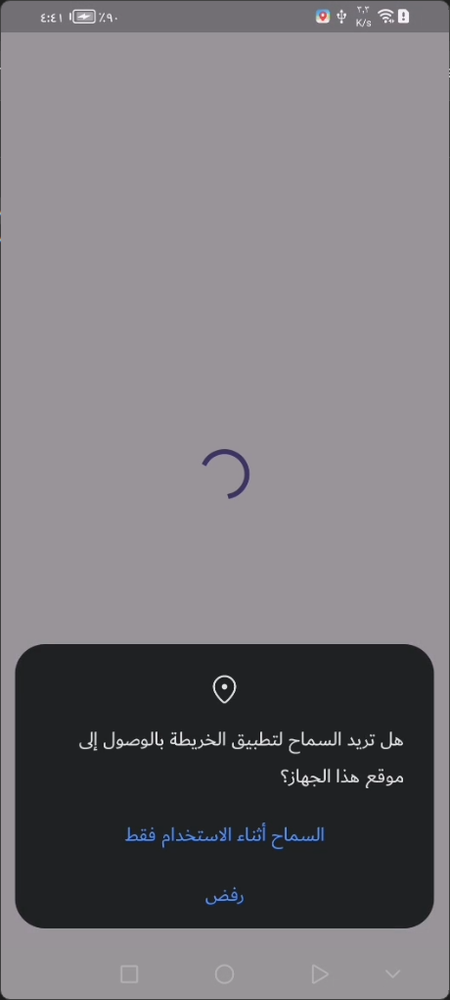
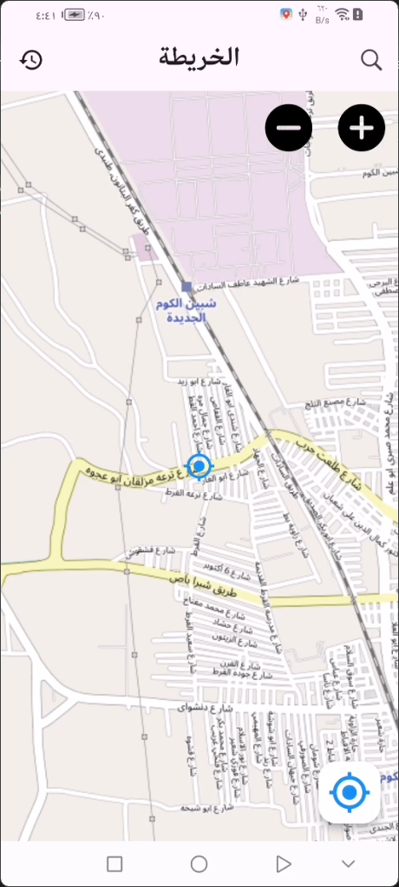
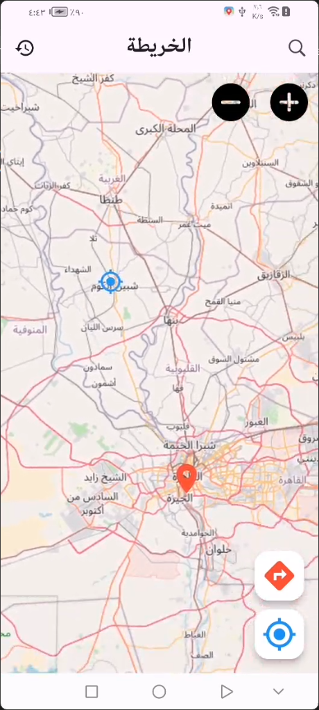
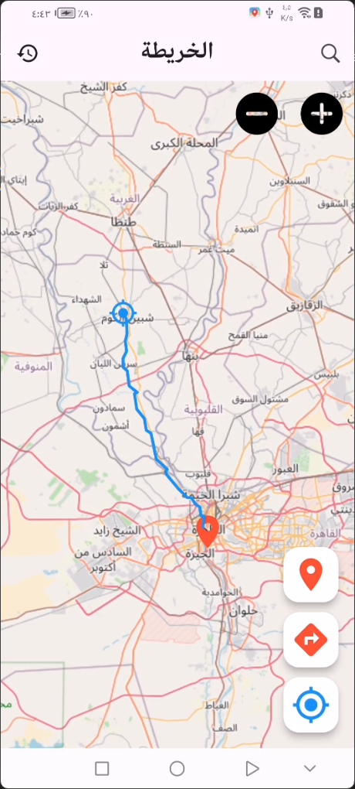
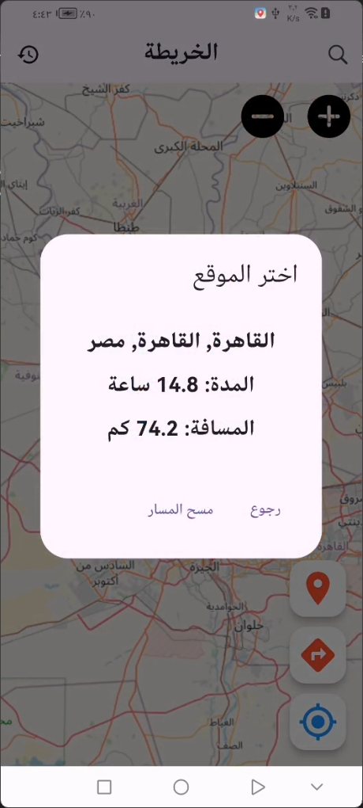
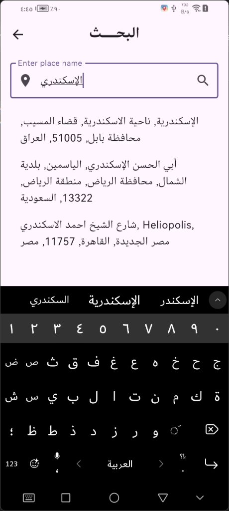

<div align="center">

# *"وَقُلْ رَبِّ زِدْنِي عِلْمًا"*

</div>
<br clear="both">
<a href="https://git.io/typing-svg"></a>
<br clear="both">

## Overview
This **`تطيبق الخريطه`** is a Flutter application that integrates OpenStreetMap functionality to provide location tracking, route directions, search features, and history management. It uses the **flutter_bloc** package to implement state management and provides a user-friendly interface for navigating maps and viewing routes.

[](https://flutter.dev/)
[](https://opensource.org/licenses/MIT)

---

## Features
- **Current Location Tracking**: Automatically detects and displays the user's current location.
- **Search Functionality**: Search for locations using names and receive location suggestions.
- **Route Directions**: Displays routes between the user's current location and a selected destination.
- **History Management**: Saves searched locations and allows users to clear the history.
- **Interactive Map**: Supports zooming, tapping on the map to set destinations, and viewing routes with polyline overlays.

---

## Screenshots

| Permission Maps Screen | Current Location Screen | Destination Location Screen | Directions Route Screen |
|---|---|---|---|
|  |  |   |   |

| Info Location Screen | Search Location Screen |  No History Screen |  History Locations Screen |
|---|---|---|---|
|  |  |   |   |

---

## Getting Started

### Prerequisites
- Install Flutter SDK: [Flutter Installation Guide](https://docs.flutter.dev/get-started/install)
- Add dependencies in `pubspec.yaml`:
  ```yaml
  dependencies:
    flutter:
      sdk: flutter
    flutter_bloc: ^8.1.1
    flutter_map: ^5.0.0
    latlong2: ^0.8.1
    shared_preferences: ^2.0.15
  ```

### Setup
1. Clone the repository:
   ```bash
   git clone <repository_url>
   ```
2. Navigate to the project directory:
   ```bash
   cd map-app
   ```
3. Get Flutter packages:
   ```bash
   flutter pub get
   ```
4. Run the app:
   ```bash
   flutter run
   ```

---

## Folder Structure
- **core/cubit**: Contains the BLoC cubits for managing state:
  - `get_location_cubit.dart`: Tracks current location.
  - `route_cubit.dart`: Handles route generation.
  - `search_cubit.dart`: Manages location search and suggestions.
- **screens**: Contains UI screens:
  - `home_screen.dart`: Main map interface.
  - `search_screen.dart`: Search and select destinations.
  - `history_screen.dart`: Displays search history.
- **widgets**: Reusable UI components like map builder, action buttons, etc.

---

## Main Components

### 1. **Home Screen**
- **Map Display**: Uses `FlutterMap` to render the OpenStreetMap tiles.
- **Floating Buttons**:
  - **Go to My Location**: Centers the map on the user's current location.
  - **Route Information**: Displays route details if a route is active.
  - **Get Directions**: Initiates directions between the current location and a tapped point.

### 2. **Search Screen**
- **Search Field**: Search for locations and view suggestions.
- **Suggestions**: Fetches and displays location suggestions dynamically.
- **Route Setup**: Automatically generates a route after selecting a location.

### 3. **History Screen**
- **View History**: Displays previously searched locations.
- **Clear History**: Allows clearing of saved search data.

### 4. **Custom Map Widgets**
- `FlutterMapBuilder`: Renders the map and handles route overlays.
- `AppBarHome`: Custom app bar for the home screen.

---

## Configuration
- **Shared Preferences**: Used for storing search history locally.
- **Map Tiles**: Configured via the `urlTemplate` in `FlutterMapBuilder`:
  ```dart
  const String urlTemplate = "https://{s}.tile.openstreetmap.org/{z}/{x}/{y}.png";
  ```

---

## Contributing

Contributions are welcome! Feel free to submit a Pull Request with improvements, bug fixes, or new features.

1. Fork the repository.
2. Create a new branch (`git checkout -b feature/my-feature`).
3. Make your changes and commit (`git commit -am 'Add new feature'`).
4. Push to the branch (`git push origin feature/my-feature`).
5. Create a new Pull Request.

## Congratulations

You’ve successfully integrated **`تطيبق الخريطه`** into your Flutter app! For more advanced features and customization options.

If you found this guide helpful, don’t forget to ⭐ star this repository on GitHub to show your support!

Thank you for reading!

## Contact

For any questions or inquiries, feel free to reach out:

- **GitHub:** [mohamedmagdy2301](https://github.com/mohamedmagdy2301)
- **Email:** [mohammedmego15@gmail.com](mohammedmego15@gmail.com)

## License

This project is licensed under the MIT License - see the [LICENSE](LICENSE) file for details.

